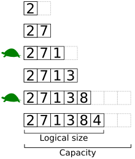

# Generic-Dynamic-Array
In computer science, a dynamic array, growable array, resizable array, dynamic table, mutable array, or array list is a random access, variable-size list data structure that allows elements to be added or removed. It is supplied with standard libraries in many modern mainstream programming languages. Dynamic arrays overcome a limit of static arrays, which have a fixed capacity that needs to be specified at allocation.

A dynamic array is not the same thing as a dynamically allocated array or variable-length array, either of which is an array whose size is fixed when the array is allocated, although a dynamic array may use such a fixed-size array as a back end.[1]


  

## Link to see:
[Wikipedia Dynamic array link](https://en.wikipedia.org/wiki/Dynamic_array#:~:text=In%20computer%20science%2C%20a%20dynamic,to%20be%20added%20or%20removed.).
## Usage:
```bash
cd src && gcc -o dynamic_array *.c && ./dynamic_array
```


